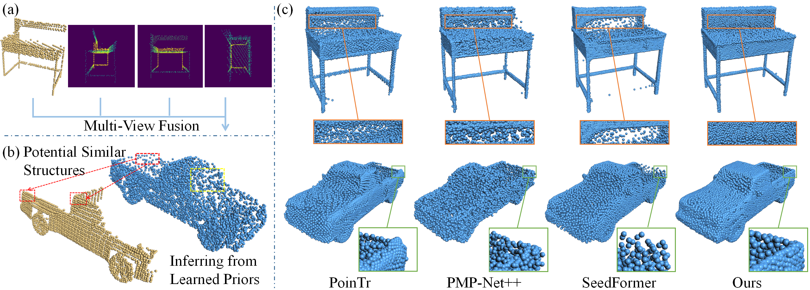

# SVDFormer: Complementing Point Cloud via Self-view Augmentation and Self-structure Dual-generator

This repository contains the PyTorch implementation of the paper:

**[SVDFormer: Complementing Point Cloud via Self-view Augmentation and Self-structure Dual-generator](https://arxiv.org/abs/2307.08492), ICCV 2023**

<!-- <br> -->
[Zhe Zhu](https://scholar.google.com/citations?user=pM4ebg0AAAAJ), [Honghua Chen](https://chenhonghua.github.io/clay.github.io/), Xing He, Weiming Wang, Jing Qin, [Mingqiang Wei](https://scholar.google.com/citations?user=TdrJj8MAAAAJ).
<!-- <br> -->


## Abstract

> In this paper, we propose a novel network, SVDFormer, to tackle two specific challenges in point cloud completion: understanding faithful global shapes from incomplete point clouds and generating high-accuracy local structures. Current methods either perceive shape patterns using only 3D coordinates or import extra images with well-calibrated intrinsic parameters to guide the geometry estimation of the missing parts. However, these approaches do not always fully leverage the cross-modal self-structures available for accurate and high-quality point cloud completion. To this end, we first design a Self-view Fusion Network that leverages multiple-view depth image information to observe incomplete self-shape and generate a compact global shape. To reveal highly detailed structures, we then introduce a refinement module, called Self-structure Dual-generator, in which we incorporate learned shape priors and geometric self-similarities for producing new points. By perceiving the incompleteness of each point, the dual-path design disentangles refinement strategies conditioned on the structural type of each point.
SVDFormer absorbs the wisdom of self-structures, avoiding any additional paired information such as color images with precisely calibrated camera intrinsic parameters. Comprehensive experiments indicate that our method achieves state-of-the-art performance on widely-used benchmarks.

## Pretrained Models
We provide pretrained SVDFormer models on PCN and ShapeNet-55/34 [here](https://drive.google.com/drive/folders/1qO1TAB-C2OOMKrUSoGUGY-nhThbBgQ5i?usp=drive_link).


## Get Started

### Requirement
- python >= 3.6
- PyTorch >= 1.8.0
- CUDA >= 11.1
- easydict
- opencv-python
- transform3d
- h5py
- timm
- open3d
- tensorboardX

Install PointNet++ and Density-aware Chamfer Distance.
```
cd pointnet2_ops_lib
python setup.py install

cd ../metrics/CD/chamfer3D/
python setup.py install

cd ../../EMD/
python setup.py install
```


### Dataset
Download the [PCN](https://gateway.infinitescript.com/s/ShapeNetCompletion) and [ShapeNet55/34](https://github.com/yuxumin/PoinTr) datasets, and specify the data path in config_*.py (pcn/55).
```
# PCN
__C.DATASETS.SHAPENET.PARTIAL_POINTS_PATH        = '/path/to/ShapeNet/%s/partial/%s/%s/%02d.pcd'
__C.DATASETS.SHAPENET.COMPLETE_POINTS_PATH       = '/path/to/ShapeNet/%s/complete/%s/%s.pcd'

# ShapeNet-55
__C.DATASETS.SHAPENET55.COMPLETE_POINTS_PATH     = '/path/to/shapenet_pc/%s'

# Switch to ShapeNet-34 Seen/Unseen
__C.DATASETS.SHAPENET55.CATEGORY_FILE_PATH       = '/path/to/datasets/ShapeNet34(ShapeNet-Unseen21)'
```
### Evaluation
```
# Specify the checkpoint path in config_*.py
__C.CONST.WEIGHTS = "path to your checkpoint"

python main_*.py --test (pcn/55)
```

### Training
```
python main_*.py (pcn/55) 
```

## Citation
```
@InProceedings{Zhu_2023_ICCV,
    author    = {Zhu, Zhe and Chen, Honghua and He, Xing and Wang, Weiming and Qin, Jing and Wei, Mingqiang},
    title     = {SVDFormer: Complementing Point Cloud via Self-view Augmentation and Self-structure Dual-generator},
    booktitle = {Proceedings of the IEEE/CVF International Conference on Computer Vision (ICCV)},
    month     = {October},
    year      = {2023},
    pages     = {14508-14518}
}
```


## Acknowledgement
The repository is based on [SnowflakeNet](https://github.com/AllenXiangX/SnowflakeNet), some of the code is borrowed from:
- [PytorchPointNet++](https://github.com/erikwijmans/Pointnet2_PyTorch)
- [Density-aware Chamfer Distance](https://github.com/wutong16/Density_aware_Chamfer_Distance)
- [PoinTr](https://github.com/yuxumin/PoinTr)
- [GRNet](https://github.com/hzxie/GRNet)
- [PointAttN](https://github.com/ohhhyeahhh/PointAttN)
- [SimpleView](https://github.com/princeton-vl/SimpleView)

The point clouds are visualized with [Easy3D](https://github.com/LiangliangNan/Easy3D).

We thank the authors for their great work！

## License

This project is open sourced under MIT license.


